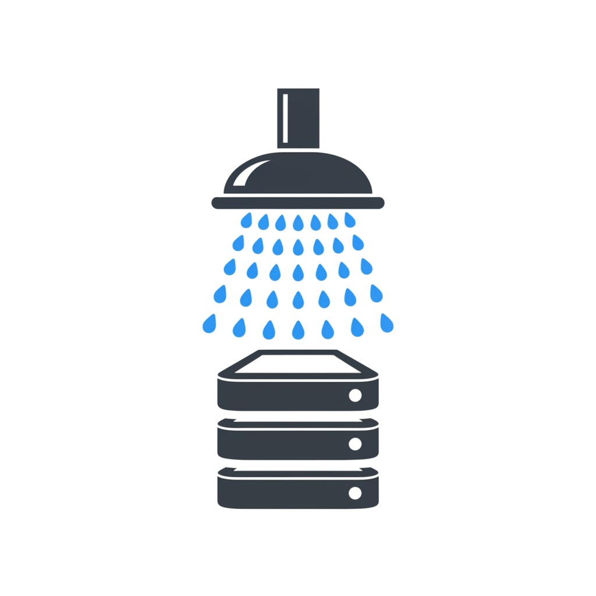
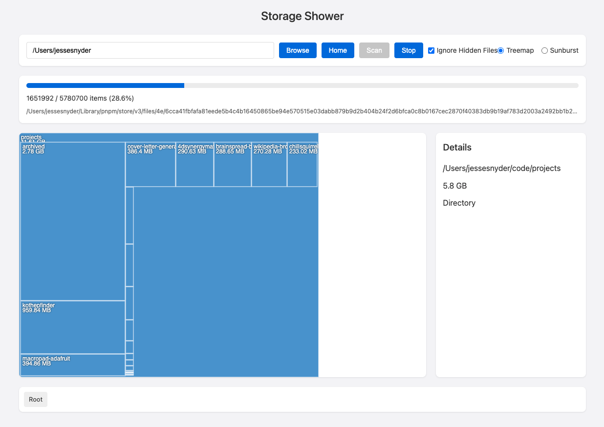

# Storage Shower

A disk space visualization tool that helps you understand where your storage is being used.

## Features

- Scan your file system to analyze disk usage
- Interactive treemap and sunburst visualizations
- Color coding by file type
- Detailed information for selected items
- Navigation through visualizations and breadcrumb trail
- Option to ignore hidden files
- Cancel scanning at any time
- Debugging mode for troubleshooting

## Technology Stack

- **Backend**: Go for filesystem scanning and API
- **Frontend**: HTML, CSS, JavaScript with D3.js for visualizations
- **Embedded Web**: Serves a web application locally in your browser

## Building the Application

### Prerequisites

- Go 1.16 or later
- Git

### Building from Source

1. Clone the repository
2. Install dependencies: `go mod download`
3. Run the application: `go run main.go`
4. For debugging, use: `go run main.go --debug`

## Usage

1. Launch the application
2. Enter a path to scan or click "Home" to start from your home directory
3. Click "Scan" to begin analyzing disk usage
4. While scanning, you can click "Stop" to cancel at any time
5. Once the scan completes, explore your disk usage through the interactive visualization
6. Click on directories to navigate deeper
7. Use the breadcrumb trail to navigate back up
8. Switch between treemap and sunburst visualizations as needed

## Implementation Details

### Core Components

- **main.go**: Core Go application with filesystem scanning and API
- **frontend/index.html**: HTML structure for the visualization UI
- **frontend/styles.css**: CSS styling for the application
- **frontend/app.js**: JavaScript for D3.js visualizations and UI interaction

### Visualizations

- **Treemap**: Represent files and directories as nested rectangles
- **Sunburst**: Represent the file hierarchy as concentric rings

### Color Coding

- Directories: Blue
- Images: Red
- Videos: Purple
- Audio: Green
- Documents: Orange
- Archives: Yellow
- Other: Gray

## License

This project is open source software.

## Troubleshooting

If you encounter issues with file size calculations or scanning:

1. Run with debug mode: `go run main.go --debug`
2. Check the console output for detailed logging
3. For very large directories, scanning may take some time or stall on certain files
4. Use the Stop button to cancel a scan that's taking too long
